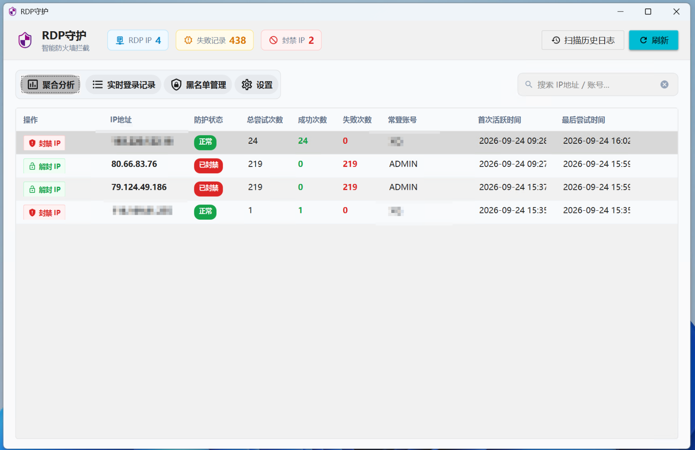
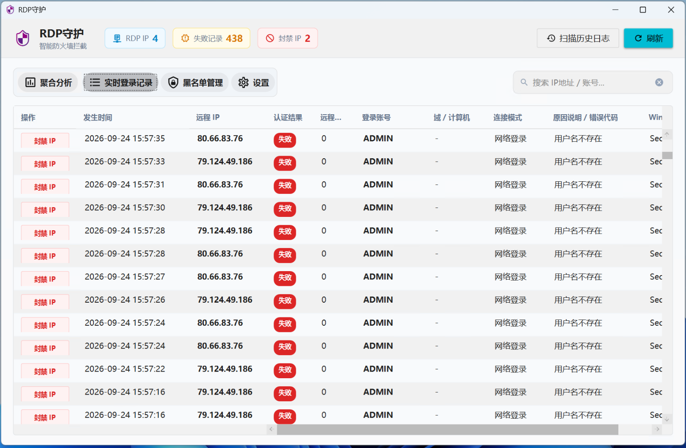
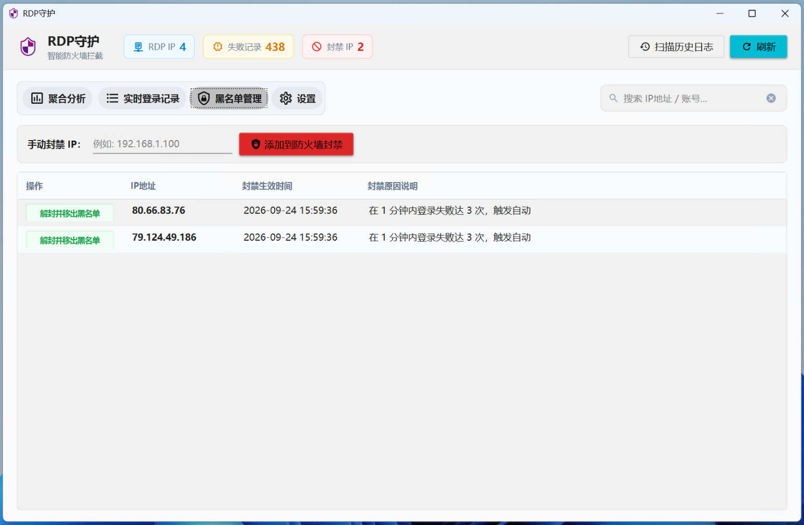
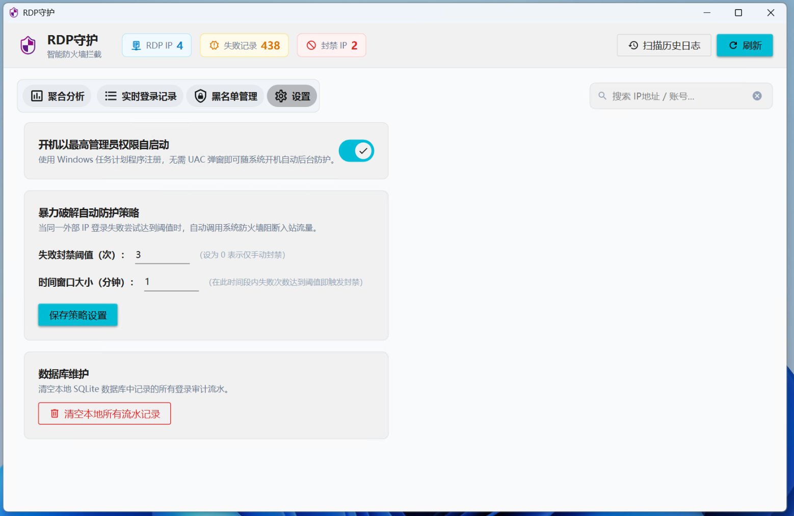
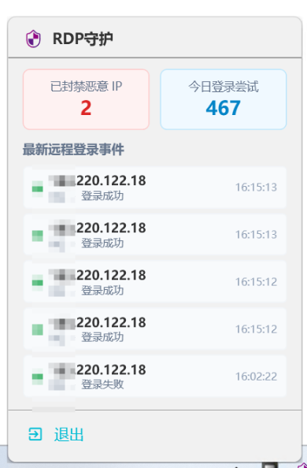

# RDPGuard.Desktop

一款基于 **.NET 10 + WPF + SQLite** 开发的现代化 Windows 远程桌面（RDP）登录实时审计与智能防火墙防护工具。

---

## 📸 界面预览

### 1. 聚合分析
自动按远程来源 IP 聚合分析，统计总尝试次数、成功/失败占比、常登账号指纹、首次与最后活跃时间，支持一键封禁与解封。


### 2. 实时登录记录
毫秒级监听 Windows 事件日志，完整捕获登录流水明细（时间、来源 IP、认证结果、远程端口、目标账号、连接模式、失败/成功原因说明）。


### 3. 黑名单管理
统一管理当前已被防火墙拦截阻断的恶意 IP，记录封禁生效时间与具体触发原因，支持手动录入 IP 封禁与一键解封。


### 4. 防护策略与设置
支持配置开机最高权限静默自启（基于 Windows 任务计划程序）、滑动时间窗口暴力破解自动拦截策略（如 N 分钟内失败达到阈值即刻触发防火墙封禁），以及本地日志数据库维护。


### 5. 系统托盘监控
常驻 Windows 系统托盘后台静默守护，支持轻量悬浮面板实时预览今日尝试统计、已封禁 IP 数与最新登录动态。
<div align="left">
  
</div>

---

## 🌟 核心功能

1. **实时与历史远程登录全量审计**
   - 实时监听 Windows Security 安全日志（EventID `4624` 成功，`4625` 失败）以及远程连接管理器日志（EventID `1149` 认证成功）。
   - 提取全面关键元数据：时间、远程 IP、端口、登录用户名、所属域/计算机名、登录模式（远程交互 RDP / 网络登录）、NT 状态码与详细原因（密码错误、用户名不存在、账户锁定、登录成功等）。
   - 内置**历史日志同步扫描**，启动即可一键拉取系统近期的所有远程登录事件流水。

2. **相同 IP 聚合智能统计分析**
   - 自动按来源 IP 归纳汇总：**总尝试次数**、**成功登录次数**、**失败次数**、**首次活跃时间**、**最后尝试时间**、**尝试过的用户名集合**（如 `ADMIN, administrator, test`）、最后状态与防火墙防护状态。
   - 实时感知 IP 的封禁与解封状态，支持在表格中快速对恶意 IP 实施防御处置。

3. **滑动时间窗口防暴破与智能防火墙联动**
   - **智能自动防护策略**：采用滑动时间窗口算法（如：*在 1 分钟内失败达 3 次* 或 *总失败达 5 次*），自动调用 Windows 原生高级防火墙入站规则组进行阻断（毫秒级生效）。
   - **防火墙规则分组**：采用规则聚合管理（每条规则容纳多达 1000 个 IP，分组为 `RDPGuard`），避免规则泛滥影响系统网络性能。
   - **安全操作确认机制**：所有封禁、解封、清空操作均配有防误触确认弹窗，保障运维安全。

4. **开机管理员权限无感静默自启**
   - 基于 `Microsoft.Win32.TaskScheduler`，使用 Windows 任务计划程序注册自启动任务。
   - 以最高管理员权限（`HighestAvailable`）随用户登录时静默自启，避免每次开机弹出 UAC 提权确认框。

5. **现代 Material Design 3 界面与无硬编码架构**
   - 基于 Material Design 规范深度定制的现代化 UI，支持分段式导航切换、卡片化统计徽章与统一配色体系。
   - 文本与颜色样式全部抽离至 `Strings.xaml` 与 `Colors.xaml` 资源字典，彻底杜绝代码与界面硬编码。

---

## 🏗️ 项目架构

```text
RDPGuard.Desktop/
│── RDPGuard.slnx                    # 解决方案文件 (.NET 10 新版规范)
│── ui/                              # 界面截图资源
│   ├── 聚合分析.png
│   ├── 实时登录记录.png
│   ├── 黑名单管理.png
│   ├── 设置.png
│   └── 右键菜单.png
│
├── src/
│   ├── RDPGuard.Common/             # 公共通用层
│   │   ├── AppGlobal.cs             # 全局信息配置
│   │   ├── Enums/                   # 枚举定义 (AppTabType 等)
│   │   ├── Helper/
│   │   │   ├── TaskSchedulerHelper.cs  # 任务计划程序帮助类（开机管理员自启）
│   │   │   ├── FirewallHelper.cs       # Windows 防火墙聚合规则（分组 RDPGuard）
│   │   │   └── ResourceHelper.cs       # 动态资源字典与多语言文本解析辅助类
│   │   ├── Model/
│   │   │   └── RdpEventModel.cs        # RDP 事件领域模型
│   │   └── Service/
│   │       └── RdpEventWatcher.cs      # Windows 事件日志实时订阅与历史检索服务
│   │
│   ├── RDPGuard.SQLite/             # 数据持久化层
│   │   ├── DbInitializer.cs         # 数据库初始化器
│   │   ├── RDPGuardDbContext.cs     # EF Core SQLite 上下文
│   │   ├── Entities/
│   │   │   ├── RdpLoginRecord.cs       # 登录流水记录实体
│   │   │   ├── BannedIp.cs             # 封禁 IP 黑名单实体
│   │   │   ├── Setting.cs              # 配置实体
│   │   │   └── AggregatedIpSummary.cs  # IP 聚合统计实体
│   │   └── Repositories/
│   │       ├── RdpRecordRepository.cs  # 登录流水与聚合查询仓储
│   │       ├── BannedIpRepository.cs   # 黑名单仓储（同步防火墙）
│   │       └── SettingRepository.cs    # 系统配置仓储
│   │
│   └── RDPGuard/                    # WPF 桌面主程序
│       ├── App.xaml / App.xaml.cs   # 应用入口（单实例防重、全局异常捕获、托盘启动）
│       ├── app.manifest             # UAC requireAdministrator 权限清单
│       ├── Convert/                 # WPF 转换器 (EnumToBoolean, ResultToBrush 等)
│       ├── Manager/
│       │   ├── Lactor.cs            # 窗口与 ViewModel 统一调度单例
│       │   └── NotifyIconManager.cs # 系统托盘管理器
│       ├── View/
│       │   ├── MainWindow.xaml      # 主界面（聚合分析、实时流水、黑名单、设置）
│       │   └── TrayPopupControl.xaml# 托盘右键悬浮监控窗口
│       ├── ViewModel/
│       │   ├── MainViewModel.cs     # 主界面 ViewModel (CommunityToolkit.Mvvm)
│       │   └── TrayPopupViewModel.cs# 托盘 ViewModel
│       └── Resources/
│           ├── Colors.xaml          # 全局颜色与动态画刷规范
│           ├── Strings.xaml         # 全局界面文案与多语言定义
│           ├── app.ico              # 应用与托盘图标
│           └── app.svg              # 矢量图标资源
```

---

## 🛠️ 技术栈

- **运行时**：.NET 10.0 (`net10.0-windows`)
- **语言**：C# 13
- **界面框架**：WPF + MaterialDesignThemes 5.2.1
- **MVVM 架构**：CommunityToolkit.Mvvm 8.4.0
- **数据持久化**：SQLite + Microsoft.EntityFrameworkCore.Sqlite 9.0.2
- **系统自启**：TaskScheduler 2.12.2
- **系统托盘**：Hardcodet.NotifyIcon.Wpf 2.0.1

---

## 🚀 编译与运行

### 1. 环境准备
- 操作系统：Windows 10 / 11 / Windows Server 2016+
- SDK：[.NET 10 SDK](https://dotnet.microsoft.com/download)
- 运行权限：**管理员权限**（调用 Windows 防火墙与事件日志服务必需）

### 2. 编译项目
```shell
dotnet build RDPGuard.slnx
```

### 3. 发布单文件运行程序
```shell
dotnet publish src/RDPGuard/RDPGuard.csproj -c Release -r win-x64 --self-contained false
```
